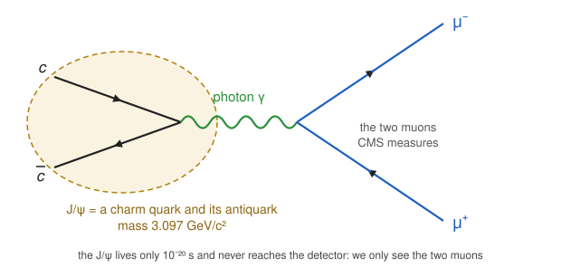

# $J/\psi$ decay

[](https://codespaces.new/aprozo/jpsi_decay?quickstart=1) [](https://mybinder.org/v2/gh/aprozo/jpsi_decay/HEAD)

This is an interactive lecture on $J/\psi$ decay via 2 muons channel in CMS from [OpenData](https://opendata.cern.ch/record/5203)  

The schematic decay picture:

 

The lecture comes in two parts, meant to be done in this order (one per day):

| | Notebook | What you do |
|---|---|---|
| **Part 1** (Day 1) | [part1_invariantMass.ipynb](part1_invariantMass.ipynb) | measure the $J/\psi$ peak in real CMS data: invariant mass, histograms, fitting, uncertainties |
| **Part 2** (Day 2) | [part2_simulation.ipynb](part2_simulation.ipynb) | simulate $J/\psi$ mesons with PYTHIA 8, add a toy detector, compare with the data |

Part 2 starts from the numbers measured in Part 1, so run [part1_invariantMass.ipynb](part1_invariantMass.ipynb) first.

The CMS Open Data files ([record 5203](https://opendata.cern.ch/record/5203), [record 5208](https://opendata.cern.ch/record/5208)) are included in [data/](data/), so no internet connection is needed once the environment is running.

---
# How to start

**GitHub Codespaces (recommended).** Click the [Codespaces button](https://codespaces.new/aprozo/jpsi_decay?quickstart=1) above. It starts a container with ROOT, Jupyter and PYTHIA pre-installed. The image is built, tested and published to `ghcr.io/aprozo/jpsi_decay` by a [GitHub Action](.github/workflows/build-image.yml) whenever the [.devcontainer/](.devcontainer/) files change, so a codespace only has to pull it.
Any GitHub account has a free monthly Codespaces quota (about 60 hours on the default 2-core machine), so no application is needed.
The first start takes a minute or two while the image is pulled. Stop the codespace when you are done to save your quota.

**Binder (alternative).** The [Binder button](https://mybinder.org/v2/gh/aprozo/jpsi_decay/HEAD) builds the same environment from [environment.yml](environment.yml). The first build after a change to the repository can take 10 to 20 minutes; later launches are faster.

**Locally.** With [conda](https://conda-forge.org/download/):

```bash
git clone https://github.com/aprozo/jpsi_decay
cd jpsi_decay
conda env create -f environment.yml
conda activate jpsi
jupyter lab
```

**Then open the notebooks.** Whichever of the three you choose, the repository and the CMS data files are already there, ROOT and PYTHIA are installed, and nothing else has to be set up. Open [part1_invariantMass.ipynb](part1_invariantMass.ipynb) (**Part 1**) and run the cells from the top with `Shift+Enter`, then [part2_simulation.ipynb](part2_simulation.ipynb) (**Part 2**). Codespaces opens the notebooks in VS Code, Binder and a local install in JupyterLab; the notebooks behave the same in both.
